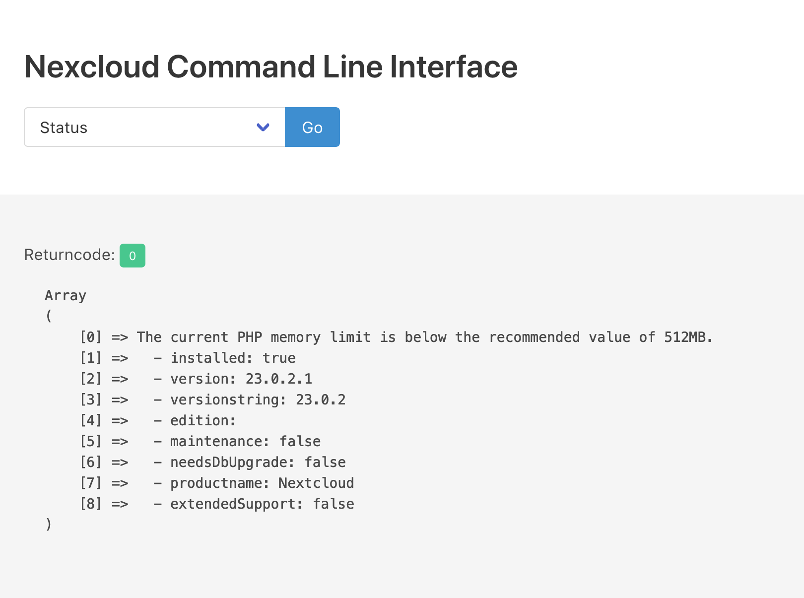

# Nextcloud-hosted-CLI



This script makes some [occ commands](https://docs.nextcloud.com/server/stable/admin_manual/configuration_server/occ_command.html#http-user-label) available to environments where you don’t 
have shell access (i. e. hosted environments).

**⚠️ A word of warning**

I don’t think this is very safe. It might corrupt your database when PHP times 
out on longer operations.  
On small installations like mine, however it works 
just fine.


# Installation

First generate a user password pair. For that, hash your password using
the [hash_password](https://www.php.net/manual/en/function.password-hash.php) 
function.

E. g. like this:

```php
<?php
echo password_hash("yourpassword", PASSWORD_DEFAULT);
?>
```

This will generate a hash of your password so you don’t have to store it on the 
server.   
Now copy the hash into `cli-config-example.php` and rename it to 
`cli-config.php`.

Now copy `cli.php` and `cli-config.php` to the root directory of 
your nextcloud installation.


# Usage

```http
https://www.your-cloud.tld/cli.php
```